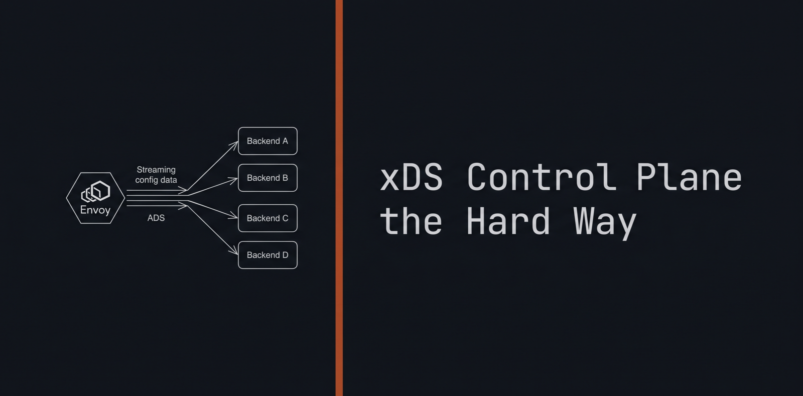

# xDS Control Plane the Hard Way

*[English](./README.md) | 日本語*

Envoy の xDS コントロールプレーンをゼロから組み立てる章立て。Kubernetes the
Hard Way の精神で書いている。Istio もサービスメッシュフレームワークも使わない。
Envoy と xDS プロトコル、そして Rust で手書きするコントロールプレーンだけ。

学ぶことに最適化してある。つまり遠回りをする。LDS、RDS、CDS、EDS、ACK/NACK、
ADS、Delta、`xdstp://`、ORCA を、なんとなく頷くだけの言葉で終わらせないために。

> この章立ては実験室であって、フレームワークではない。本番では動かさないこと。

## スタック

- データプレーンは Docker 上の Envoy。
- コントロールプレーンは `tonic` で手書きする。[`xds-api`](https://crates.io/crates/xds-api)
  クレートは生成済み protobuf のためだけに使う。
- 小さなアップストリーム HTTP サーバ (Rust の `hyper`)。
- `docker compose` と `make` で全体を繋ぐ。

ADS サーバ、スナップショット、ACK/NACK の処理は、あえてすべて手書きする。
`xds-api` は protobuf からコードを生成するだけで、それ以上は何もしない。

## 章立て

各章はそれぞれ完結したスタック。`make up` で起動し、`make down` で片付ける。

1. [Hello, xDS](chapter-01/)。その名に値する最小のスタック。Listener、Route、
   Cluster、Endpoint を 1 つずつ ADS で配る。アップストリームを curl して、
   4 つの ACK が流れるのを眺める。
2. [スナップショットの差し替えとロールバック](chapter-02/)。壊れた Listener を
   push して、NACK でバージョンが巻き戻るのを見る。
3. [mTLS を始めるための静的 SDS](chapter-03/)。SDS で証明書を注入し、
   ホットローテーションを見る。
4. [Delta xDS](chapter-04/)。同じスタックを Delta プロトコルで。
5. `xdstp://` と複数オーソリティ。フェデレーション bootstrap と 2 つ目の
   コントロールプレーン。(予定)
6. ORCA の帯域外ロードレポート。バックエンドが擬似的な負荷を報告し、
   バランサが軽い方の pod を選ぶ。(予定)

## ライセンス

MIT。[LICENSE](./LICENSE) を参照。
